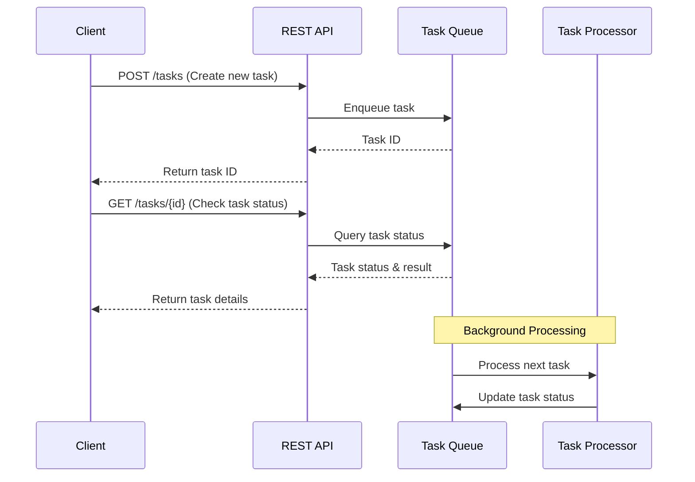

# Task Manager
Асинхронная очередь и REST API на Golang


```mermaid
sequenceDiagram
    participant Client
    participant REST API
    participant Task Queue
    participant Task Processor

    Client->>REST API: POST /tasks (Create new task)
    REST API->>Task Queue: Enqueue task
    Task Queue-->>REST API: Task ID
    REST API-->>Client: Return task ID

    Client->>REST API: GET /tasks/{id} (Check task status)
    REST API->>Task Queue: Query task status
    Task Queue-->>REST API: Task status & result
    REST API-->>Client: Return task details

    Note over Task Queue,Task Processor: Background Processing
    Task Queue->>Task Processor: Process next task
    Task Processor->>Task Queue: Update task status
```

## Run
```
go run main.go
```
Import `openapi.yaml` in your editor and make requests!